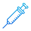

# About

An example to read a connection string from appsettings.json using [ConsoleConfigurationLibrary](https://www.nuget.org/packages/ConsoleConfigurationLibrary/#readme-body-tab)  NuGet package for Microsoft EF Core 8 using a modified version of Microsoft NorthWind database.