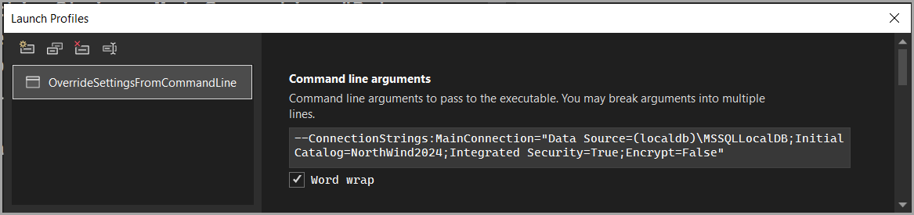

# About

This project demonstrates how to override settings from the appsettings.json file using command-line arguments.

appsettings.json which `MainConnection` is used to connect to a SQL-Server database.

```json
{
  "ConnectionStrings": {
    "MainConnection": "Data Source=(localdb)\\MSSQLLocalDB;Initial Catalog=WinesDapper;Integrated Security=True;Encrypt=False",
    "SecondaryConnection": "Data Source=(localdb)\\MSSQLLocalDB;Initial Catalog=NorthWind2024;Integrated Security=True;Encrypt=False",
    "OtherConnection": ""
  }
}
```

To override the `MainConnection` connection string, use the `--ConnectionStrings:MainConnection="Data Source=(localdb)\MSSQLLocalDB;Initial Catalog=NorthWind2024;Integrated Security=True;Encrypt=False"`

Which can be done by 

```
dotnet run --ConnectionStrings:MainConnection="Data Source=(localdb)\MSSQLLocalDB;Initial Catalog=NorthWind2024;Integrated Security=True;Encrypt=False"

```

Or via Debug properties in Visual Studio.



## Code walkthrough

- Determine if an argument has been passed, does not validate that the argument is a correct connection string.
- Check if the database exists, if so open else report the database does not exist.

## Projects

Utilizes `ConsoleConfigurationLibrary` which is also a NuGet package.

## Microsoft 

[Command-line configuration provider](https://learn.microsoft.com/en-us/dotnet/core/extensions/configuration-providers#command-line-configuration-provider)
